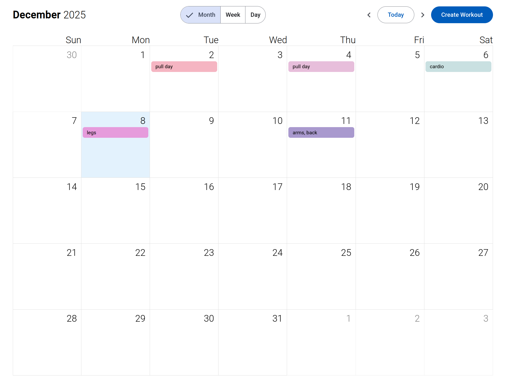
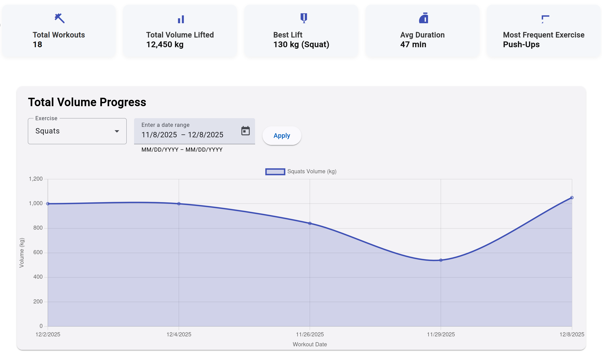
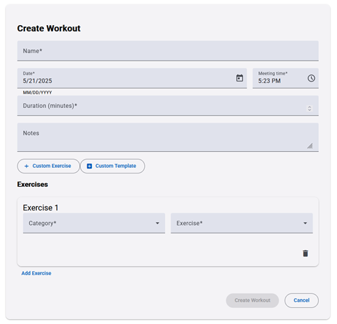
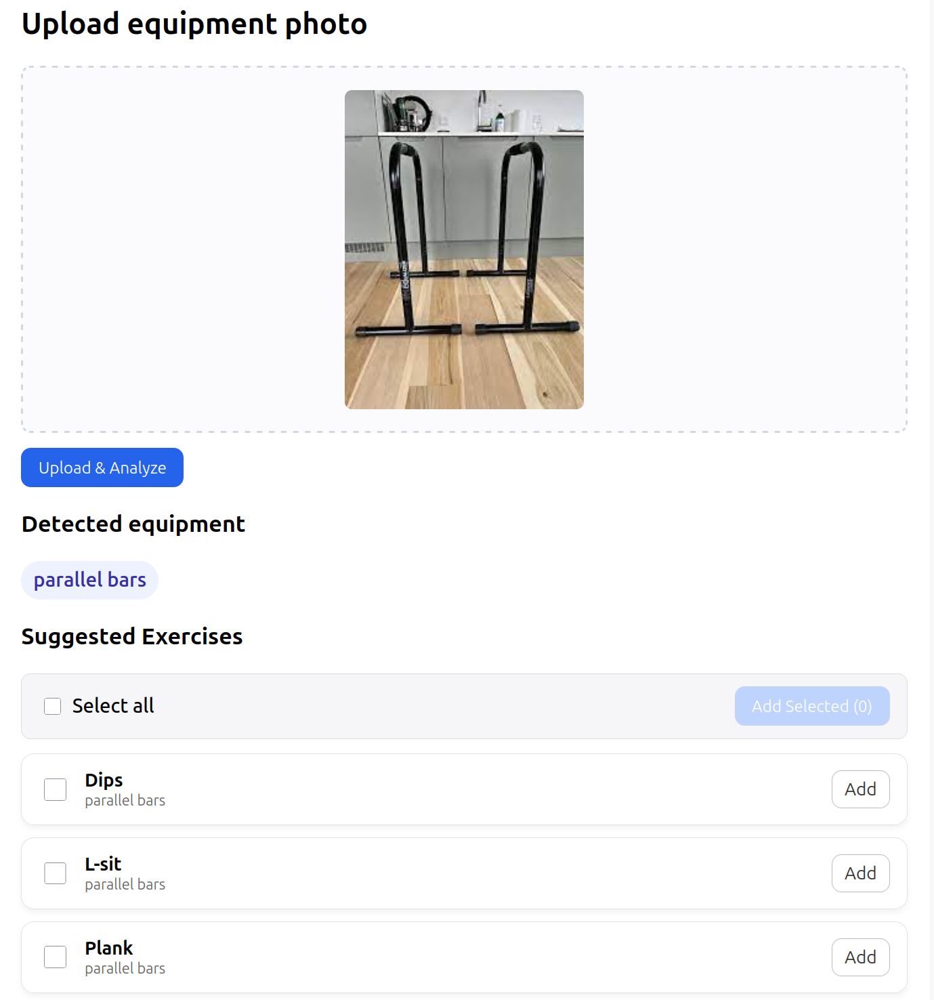

# Physical Activity Analysis — Frontend

This repository contains the frontend for a physical activity analysis system that allows users to track workouts, visualize progress, and manage training schedules. The interface includes charts, calendar-based workout tracking, and equipment recognition features that support exercise recommendations.

The application is built using **Angular** and communicates with the backend through a REST API.

---

## Features

- User authentication using JWT access and refresh tokens
- Automatic token refresh using Angular interceptors
- Workout diary management
- Calendar-based workout scheduling
- Progress visualization using charts
- Exercise and workout template management
- Equipment recognition interface (image upload)
- Responsive user interface

---

## Technologies

- Angular
- TypeScript
- Angular Interceptors
- ng2-charts
- JWT Authentication
- REST API
- Docker
- GitHub CI/CD

---

## Screenshots

### Workout Calendar

Calendar interface for scheduling and tracking workouts.

---

### Workout Statistics

Charts showing workout progress and activity trends using **ng2-charts**.

---

### Workout Management

Interface for creating, editing, and managing workouts and workout templates.

---

### Equipment Recognition

Allows users to upload an image of available equipment and receive exercise recommendations.

---

Link to WorkoutDiaryBackend - https://github.com/TarasRokochyi/WorkoutDiaryBackend
